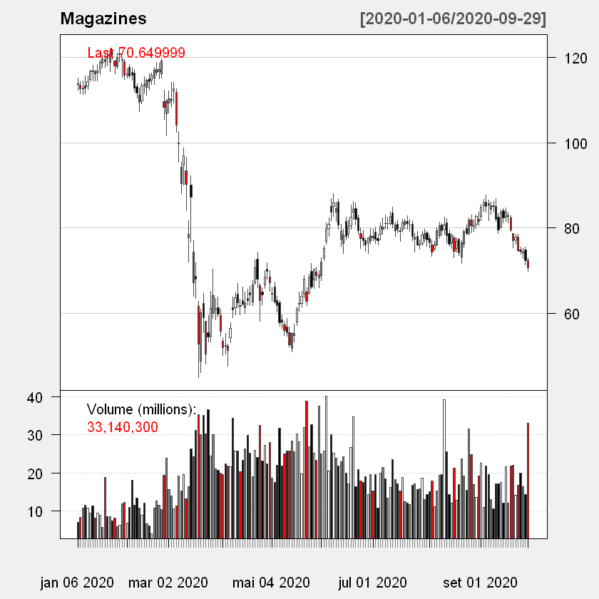

>>> # Análise do Mercado de Ações - Magazines de Moda do Brasil

>>> ### Análise das principais redes de varejo de magazine das lojas C&A, Renner, Marisa e Ricahuelo
>>> ##### Rálisson Araújo Ribeiro

> #### Instalação dos principais pacotes para coletadas das ações no Yahoo Finance


```python
# Instalando os pacotes necessários para a analise
install.packages("quantmod")
install.packages("xts")
install.packages("moments")
library(quantmod)
library(xts)
library(moments)
```

    package 'quantmod' successfully unpacked and MD5 sums checked
    
    The downloaded binary packages are in
    	C:\Users\ralis\AppData\Local\Temp\Rtmp4sCujG\downloaded_packages
    package 'xts' successfully unpacked and MD5 sums checked
    
    The downloaded binary packages are in
    	C:\Users\ralis\AppData\Local\Temp\Rtmp4sCujG\downloaded_packages
    package 'moments' successfully unpacked and MD5 sums checked
    
    The downloaded binary packages are in
    	C:\Users\ralis\AppData\Local\Temp\Rtmp4sCujG\downloaded_packages
    

    Warning message:
    "package 'quantmod' was built under R version 3.6.3"Loading required package: xts
    Warning message:
    "package 'xts' was built under R version 3.6.3"Loading required package: zoo
    
    Attaching package: 'zoo'
    
    The following objects are masked from 'package:base':
    
        as.Date, as.Date.numeric
    
    Loading required package: TTR
    Registered S3 method overwritten by 'quantmod':
      method            from
      as.zoo.data.frame zoo 
    Version 0.4-0 included new data defaults. See ?getSymbols.
    

> #### Definindo um período para análise das cotações


```python
#Selecionando as datas de inicio e fim

StarDate = as.Date("2020-01-06")
EndDate = as.Date("2020-09-30")
```

> #### Coleta das informações diretamente no Yahoo Finance


```python
# Coletando as informações das ações

getSymbols("AMAR3.SA", src = "yahoo", from = StarDate, to = EndDate)
getSymbols("LREN3.SA", src = "yahoo", from = StarDate, to = EndDate)
getSymbols("GUAR3.SA", src = "yahoo", from = StarDate, to = EndDate)
getSymbols("CEAB3.SA", src = "yahoo", from = StarDate, to = EndDate)
```

    'getSymbols' currently uses auto.assign=TRUE by default, but will
    use auto.assign=FALSE in 0.5-0. You will still be able to use
    'loadSymbols' to automatically load data. getOption("getSymbols.env")
    and getOption("getSymbols.auto.assign") will still be checked for
    alternate defaults.
    
    This message is shown once per session and may be disabled by setting 
    options("getSymbols.warning4.0"=FALSE). See ?getSymbols for details.
    
    Warning message:
    "AMAR3.SA contains missing values. Some functions will not work if objects contain missing values in the middle of the series. Consider using na.omit(), na.approx(), na.fill(), etc to remove or replace them."


'AMAR3.SA'


    Warning message:
    "LREN3.SA contains missing values. Some functions will not work if objects contain missing values in the middle of the series. Consider using na.omit(), na.approx(), na.fill(), etc to remove or replace them."


'LREN3.SA'


    Warning message:
    "GUAR3.SA contains missing values. Some functions will not work if objects contain missing values in the middle of the series. Consider using na.omit(), na.approx(), na.fill(), etc to remove or replace them."


'GUAR3.SA'


    Warning message:
    "CEAB3.SA contains missing values. Some functions will not work if objects contain missing values in the middle of the series. Consider using na.omit(), na.approx(), na.fill(), etc to remove or replace them."


'CEAB3.SA'


> #### Criando um gráfico, já com a soma das ações de Riachuelo, Renner, C&A e Marisa


```python
#Criando um gráfico
candleChart(AMAR3.SA + LREN3.SA + GUAR3.SA + CEAB3.SA, multi.col= TRUE, theme= "white", name = "Magazines")
```


    

    


#### Percebemos que o valor da soma das ações dos principais magazines do Brasil ainda não voltou para o patamar pré-covid. Esta sugestão de preço pode estar relacionada com a tendêcia baixa de consumo, porém a correlação deverá ser analisada com novos dados.
